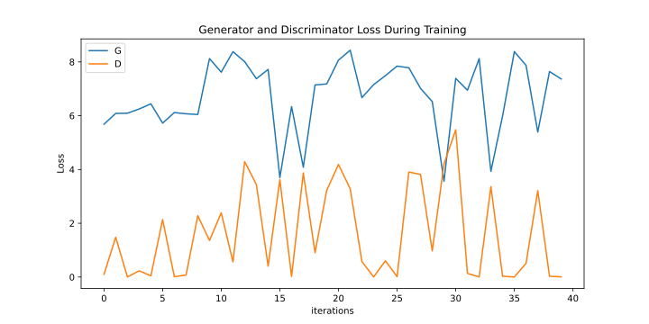

# Generating synthetic drawings with Google QuickDraw
### Mini-Project in Advanced Machine Learning (Spring 2023) IT-University of Copenhagen
### Members: 
Mads Høgenhaug (mkrh@itu.dk), Marcus Friis (mahf@itu.dk), Morten Pedersen (mohp@itu.dk)


<div style="display: flex;">
    
    
</div>

This project generates fake drawings using Generative Adversarial Networks (GAN), using the [Google Quickdraw](https://quickdraw.withgoogle.com/data) dataset. 

## The dataset
This project uses the [Google Quickdraw](https://quickdraw.withgoogle.com/data) dataset. It consists of 50 million 28x28 greyscale images across 345 different classes. Google has preprocessed the data by centering and scaling the drawings appropriately. Due to the complexity of the problem, we currently use and generate cats, dogs, apples, and stop-signs. We experimented with both cats and dogs. 

## Methodology
Throughout the process, we trained many models with multiple architecture types. We incrementally experimented with model depth, learning rate, dropout and batch size, changing one aspect at a time and investigating the result, leading us the current setup. The architectures used for the final and best performing generator and discriminator are *[SuperDeepGenerator](src/models.py)* and *[SuperDeepConvDiscriminator](src/models.py)* respectively. 

### Generator - *[SuperDeepGenerator](src/models.py)*
The generator is a convolutional model, that generates a 28x28 synthetic drawing from a latent vector. It contains 4 transposed convolutional layers, each halving the amount of channels. Between layers, we apply batch normalization and activate the layer with ReLU. For added randomness, and to combat mode collapse, we use dropout on all layers except the last. For the last layer, we convolve to 1 channel, and activate it with sigmoid to scale values between 0 and 1. 

### Discriminator -  *[SuperDeepConvDiscriminator](src/models.py)*
The discriminator consists of 4 convolutions with batch normalization and leaky ReLU after each layer, followed with a flattening operation, and two linear layers, lastly activated with sigmoid for binary classification. 

### Training
For training the model, we instanciate a generator and discriminator. We repeat the following steps for n_epochs.

#### Step 1
We train the discriminator; we generate fake samples with the generator, and the discriminator predicts whether a drawing is real or fake on both the fake and real data. We calculate the loss of this process, backpropagate and take an optimizer step. 

#### Step 2
The generator generates a new batch. The discriminator predicts, and we calculate the loss as a binary cross entropy, such that the generator is rewarded if it fools the discriminator. We calculate the loss of this process, backpropagate and take an optimizer step. 

## Results
When a model is trained, it can generate drawings. The discriminator is usually better than the generator, as seen on the loss curve.

<div style='display: flex;'>
    
    
</div>

We experimented with generating dogsl, stop signs, apples and cats+dogs as well. The resulting figures can be found in [figs](figs)

While these results are not perfect, they're a good start. Randomness seemed to help the model generalize better, and we observed deeper models performed better than shallower models. 


## Replicate our results
To replicate our results, run 
```
python train.py
```
This script can be modified to change hyperparameters, models, data etc. 
We use ml-flow for tracking experiment results. As such, an ml-flow server must be hosted for the script to execute correctly. We hosted it on a local host with the command 

```
mlflow ui
```

More models can be added in *[src/models.py](src/models.py)*. 
